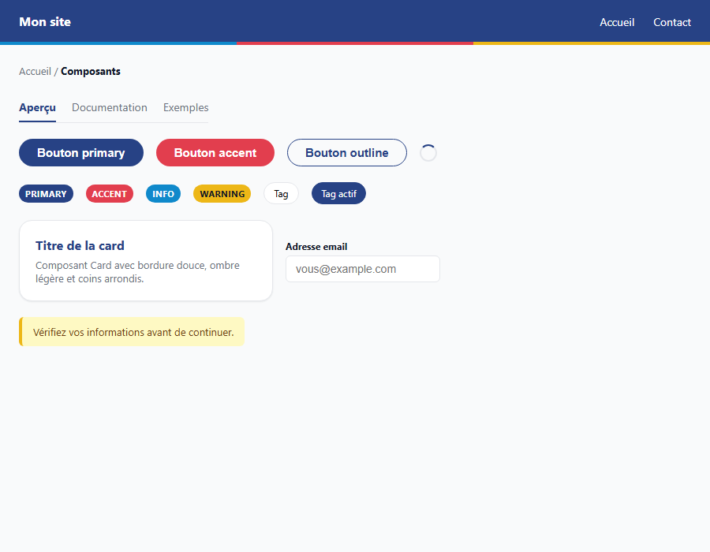

# nglui

A small, dependency-free TypeScript utility library. Ships ESM + CJS builds with full type declarations.

[](https://www.npmjs.com/package/nglui)

## Install

```bash
npm install nglui
```

## Usage

```ts
import { classNames, debounce } from "nglui";

classNames("btn", { "btn--active": isActive }, ["extra", null]);
// => "btn btn--active extra"

const onSearch = debounce((query: string) => fetchResults(query), 300);
onSearch("he");
onSearch("hello"); // only this call runs, 300ms after the last keystroke

onSearch.cancel(); // drop a pending call
onSearch.flush(); // run a pending call now

clamp(15, 0, 10); // => 10
unique([1, 2, 2, 3]); // => [1, 2, 3]
pick({ a: 1, b: 2 }, ["a"]); // => { a: 1 }
```

## API

### `classNames(...values: ClassValue[]): string`

Joins class values into a space-separated string. Accepts strings, numbers, arrays (flattened recursively), and objects (keys kept when their value is truthy). Falsy values are skipped.

### `debounce<Args>(fn, wait = 0): Debounced<Args>`

Trailing-edge debounce. The wrapped call fires once `wait` milliseconds have elapsed since the most recent invocation, using the latest arguments.

- `cancel()` — discards a pending call.
- `flush()` — invokes a pending call immediately.

### `clamp(value, min, max): number`

Restricts `value` to the inclusive range `[min, max]`.

### `unique(values)` / `uniqueBy(values, keyFn)`

Removes duplicates from an array, preserving first-seen order. `uniqueBy` dedupes using a derived key.

### `pick(obj, keys)` / `omit(obj, keys)`

Returns a shallow copy of `obj` with only (or all but) the given keys.

## UI components

`nglui/ui` exports a small set of React components styled with an
institutional, high-contrast design system (navy, accent red, pill-shaped
buttons). Styles are applied inline as plain objects — no CSS file to
import. `react` is only required as a peer dependency if you use this entry
point; it does not affect the core utilities above.

```bash
npm install nglui react
```

```tsx
import { Navbar, Card, Badge, Button, Input, Alert, Footer } from "nglui/ui";

function Example() {
  return (
    <>
      <Navbar logo={<strong>Mon site</strong>}>
        <a href="#">Accueil</a>
        <a href="#">Contact</a>
      </Navbar>

      <Card>
        <Badge tone="accent">Nouveau</Badge>
        <h3>Titre</h3>
        <p>Contenu de la card.</p>
        <Button variant="primary">Lire l'article</Button>
      </Card>

      <Input label="Adresse email" type="email" placeholder="vous@example.com" />

      <Alert tone="warning">Vérifiez vos informations avant de continuer.</Alert>

      <Footer>© 2026 Mon site</Footer>
    </>
  );
}
```



Available components:

| Component | Notes |
| --- | --- |
| `Navbar` | Header bar with an optional `logo` slot and nav children. |
| `Footer` | Dark footer container. |
| `Hero` | Full-width intro/banner section. |
| `Card` | Bordered surface with soft shadow. |
| `Grid` | CSS grid layout helper (`columns`, `gap`). |
| `Button` | Variants: `primary`, `accent`, `outline`. |
| `Badge` | Tones: `primary`, `accent`, `info`, `warning`, `neutral`. |
| `Tag` | Selectable pill button (`selected` state). |
| `Input` | Labeled text input with focus styling. |
| `Alert` | Tones: `info`, `success`, `warning`, `error`. |
| `Modal` | Overlay dialog (`open`, `onClose`, `title`). |
| `Tabs` | Tab list driven by `items` + `activeKey`/`onChange`. |
| `Breadcrumb` | Linked trail built from an `items` array. |
| `Divider` | `line`, or `tricolor` accepting a custom `colors` array (any length) or a CSS `gradient`. |
| `Spinner` | Small loading indicator. |

Design tokens (`colors`, `radii`, `spacing`, `typography`, `shadows`) are
also exported from `nglui/ui` for building custom components on the same
system.

## Development

```bash
npm install
npm test          # vitest
npm run lint       # eslint
npm run format      # prettier --write
npm run typecheck # tsc --noEmit
npm run build     # tsup -> dist/
```

## Releasing

Versioning and publishing are managed by [Changesets](https://github.com/changesets/changesets):

1. `npx changeset` — describe your change and pick a bump (patch/minor/major).
2. Commit the generated file under `.changeset/` and push/merge to `main`.
3. The `Release` GitHub Actions workflow opens a "Version Packages" PR; merging it publishes the new version to npm automatically.

The workflow requires an `NPM_TOKEN` repository secret (an npm automation token).

## License

MIT © josaphatmayuba
